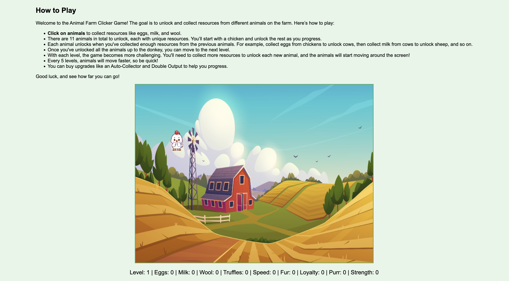
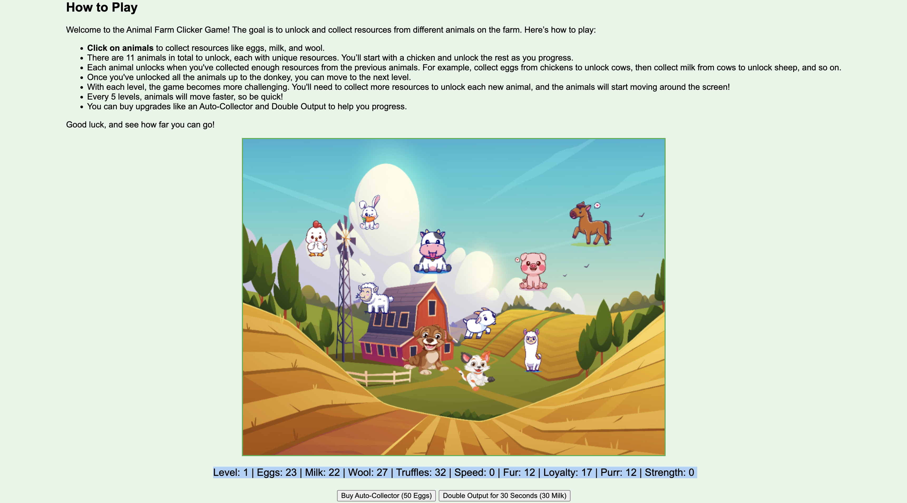

# Animal Farm Clicker Game

Welcome to the **Animal Farm Clicker Game**! A fun and interactive web-based clicker game where players collect resources, unlock animals, and advance through progressively challenging levels. Built using HTML5, CSS3, and JavaScript, this game offers a dynamic and enjoyable experience for players of all ages.

---

## 🐾 How to Play

1. **Click on Animals**  
   Start by clicking on the animals to collect resources like eggs, milk, and wool.

2. **Unlock New Animals**
    - Each animal unlocks after you've collected enough resources from the previous ones.
    - For example, collect eggs from chickens to unlock cows, then milk from cows to unlock sheep, and so on.

3. **Advance Through Levels**
    - After unlocking all 11 animals up to the donkey, you'll have the option to move to the next level.
    - Each level increases the difficulty:
        - **More resources required** to unlock animals.
        - Animals begin to move across the screen from Level 2 onwards.
        - Every 5 levels, the animals' speed increases!

4. **Upgrades and Boosts**
    - Buy an **Auto-Collector** to collect resources automatically.
    - Activate **Double Output** for 30 seconds to collect resources faster.

5. **Challenge Yourself**  
   Progress through the levels, master the farm, and see how far you can go!

---

## 🛠️ Features

- **Dynamic Gameplay:** Unlock 11 unique animals, each with distinct resources.
- **Progressive Difficulty:** Levels get harder with more resources required and faster-moving animals.
- **Interactive Upgrades:** Auto-Collector and Double Output to enhance gameplay.
- **Smooth Animations:** Animals move across the screen starting at Level 2.
- **Responsive Design:** Optimized for both desktop and mobile screens.

---

🖼️ Screenshots
- **Starting the Game:**

- **Mid-Game with Unlocked Animals:**

---

🤝 Contributing
Contributions are welcome! If you’d like to enhance the game, feel free to fork the repository, make your changes, and submit a pull request.

---

Acknowledgments
- Background image and animal sprites sourced from [Freepik](https://www.freepik.com/).
- Inspiration for gameplay mechanics from classic clicker games.

---

🔗 Links
- GitHub Repository: [Animal Farm Clicker Game](https://github.com/Gorvok/tiny-farm-game)
- Play the Game Online: [Live Demo](https://gorvok.github.io/tiny-farm-game/)

---

Enjoy the game! 🐔🐄🐑🐖
